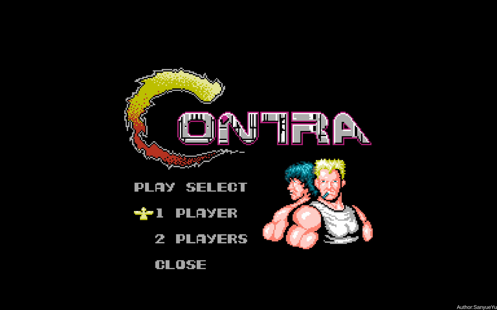
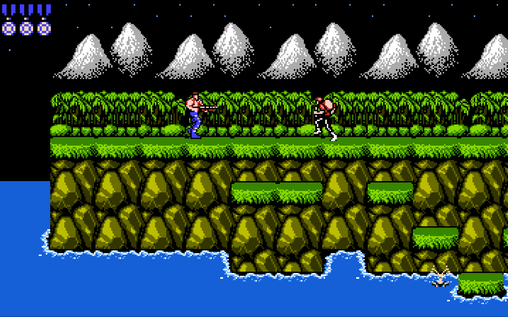

## 介绍
这是一个使用Unity引擎复刻的魂斗罗游戏项目。
里面包含了实现游戏第一关（只有一关）所需的程序、美术等资源。

## 版本与插件
* Unity编辑器：2021.3.19f1c1
* TextMesh Pro：3.0.9
* Cinemachine：2.8.9
* Addressable：1.19.19
* InputSystem：1.5.1

此外，本项目使用了一些额外的插件/代码库

* [DoTween](https://github.com/Demigiant/dotween.git)：v1.2.765
* [Mirro](https://github.com/MirrorNetworking/Mirror.git)：89.8.0
* [ParrelSync](https://github.com/VeriorPies/ParrelSync.git)：1.5.2

## 操作与控制
### 菜单界面
* <kbd>W</kbd>：上一个项目
* <kbd>S</kbd>：下一个项目
* <kbd>J</kbd>：确定
* <kbd>K</kbd>：返回
* <kbd>ESC</kbd>：退出到桌面

### 游戏操作
#### P1
<kbd>W</kbd>：向上；<kbd>S</kbd>：向下/卧倒/潜水

<kbd>A</kbd>：向左移动；<kbd>D</kbd>：向右移动

<kbd>J</kbd>：射击/借命；<kbd>K</kbd>：跳跃

#### P2（本地双人）
<kbd>↑</kbd>：向上；<kbd>↓</kbd>：向下/卧倒/潜水

<kbd>←</kbd>：向左移动；<kbd>→</kbd>：向右移动

<kbd>,</kbd>：射击/借命；<kbd>.</kbd>：跳跃

#### P2（联机双人）
同P1

## 游戏模式
游戏可以运行在三种模式下
* 单人游戏
* 本地双人游戏
* 联机双人游戏

### 单人游戏
在菜单中选择`[1 PLAYER]`来以该模式进入游戏。该模式下，游戏运行在一台设备上，由一个玩家来操控一个角色。

### 本地双人游戏
在菜单中选择`[2 PLAYERS] - [LOCAL]`来以该模式进入游戏。在该模式下，游戏运行在一台设备上，由两个玩家来操控两个角色。

### 联机双人游戏
在菜单中选择`[2 PLAYERS] - [HOST]或[CLIENT LAN]或[CLIENT CUSTOM]`来以该模式进入游戏。在该模式下，游戏运行在两台设备上，每台设备上都由一个玩家来操作一个角色。

## 联机方式
游戏允许玩家以两种方式来进行联机双人游戏
* 局域网联机
* 自定义联机

### 局域网联机
当两台设备都处于同一个局域网内，可以使用该方式。

首先，一台设备要在菜单中选择`[2 PLAYERS] - [HOST]`充当Host。第二台设备在菜单中选择`[2 PLAYERS] - [CLIENT LAN]`充当Client。然后在`LAN ROOM`列表中选中Host对应的IP地址。此时，Host设备上会显示Client的IP地址。最后，Host按下确定键来开始游戏。

在该方式下，Client端会自动搜索局域网内可以加入的房间，玩家只需要选择想要进入的房间即可。

### 自定义联机
无论两台设备是否处于同一个局域网内，都可以使用该方式（但要确保两台设备可以无障碍地互相访问）。

首先，一台设备要在菜单中选择`[2 PLAYERS] - [HOST]`充当Host。第二台设备在菜单中选择`[2 PLAYERS] - [CLIENT CUSTOM]`充当Client。然后在输入框内输入Host的IP地址与端口号，其中，IP地址应该为点分十进制，端口号与IP地址之间以`:`分隔（如：192.168.0.2:7777）。当输入完成后，Client按下确定键，此时Host设备上会显示Client的IP地址。最后，Host按下确定键来开始游戏。